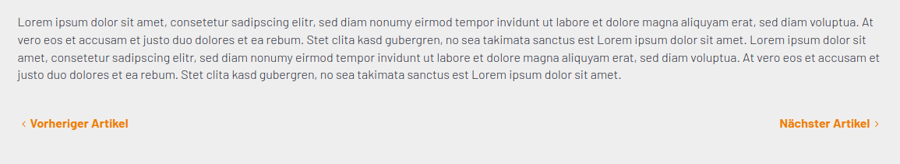

# Contao Newsnavigation Bundle

[](https://packagist.org/packages/heimrichhannot/contao-newsnavigation-bundle)
[](https://packagist.org/packages/heimrichhannot/contao-newsnavigation-bundle)
[](https://packagist.org/packages/heimrichhannot/contao-newsnavigation-bundle)


A [contao](https://contao.org/de/) extension to provide a simple navigation between news articles. It add template variables to go from one news article to the next or the previous article. 
News article order is calculated by time property.



## Features

* add Template variables to NewsReaderModule to jump between news articles
* customize article navigation with custom filters

## Installation

Install via composer:

```
composer require heimrichhannot/contao-newsnavigation-bundle
```

## Usage

The bundle provides two new variables for news reader templates: `nextArticle` and `previousArticle`.

```twig

    <a href="{{ previousArticle.url }}" class="previous">
        {{ previousArticle.label }}
    </a>



    <a href="{{ nextArticle.url }}" class="next">
        {{ nextArticle.label }}
    </a>

```

```php
<?php if ($this->previousArticle): ?>
    <a href="<?= $this->previousArticle->url ?>" title="<?= $this->previousArticle->title ?>"><?= $this->previousArticle->label ?></a>
<?php endif; ?>
<?php if ($this->nextArticle): ?>
    <a href="<?= $this->nextArticle->url ?>" title="<?= $this->nextArticle->title ?>"><?= $this->nextArticle->label ?></a>
<?php endif; ?>
```

## Customize article navigation

To customize which articles are shown as next and previous, you can use the [NewsNavigationFilterEvent](src/Event/NewsNavigationFilterEvent.php) event. 
It gets passed a filter instance and the `ModuleModel` instance.
To modify the filter, use the methods of the filter object.

Example:

```php
use HeimrichHannot\NewsNavigationBundle\Event\NewsNavigationFilterEvent;

function __invoke(NewsNavigationFilterEvent $event): void
{        
    if ($event->model->someCustomTstamp) {
        $event->filter->setColumns(array_merge($event->filter->getColumns(), ['someCustomTstamp>=?']));
        $event->filter->setValues(array_merge($event->filter->getValues(), [$event->model->someCustomTstamp]));
    }
    
    if (!empty(StringUtil::deserialize($event->moduleModel->categories, true))) {
        $filter->setColumns(array_merge($filter->getColumns(), ['tl_news.categories IN (?)']));
        $filter->setValues(array_merge($filter->getValues(), StringUtil::deserialize($event->moduleModel->categories, true)));
    }
}
```
